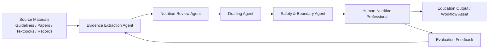

<div align="center">

# Nutrition Assistants

**Turning authoritative nutrition sources and guidelines into traceable, reusable agent Skills and workflows, with human-review boundaries.**

[](#project-overview)
[](#ai-applications)
[](#maintainer)
[](README.md)

**[中文 README](README.md)** · [Start here](#start-here) · [Content map](#content-map) · [Repository structure](#repo-structure) · [Safety scope](#safety-scope)


</div>

> **Safety boundary**
>
> This project is for **nutrition education, structured knowledge organization, and professional review support** — not a diagnosis, prescription, treatment-replacement, efficacy-guarantee, or regulatory-approval tool. For disease, medication, or other risk scenarios, consult a physician, registered dietitian, or other qualified professional.

## Project Introduction

> **Tagline**  
> Evidence-informed nutrition education, AI-assisted nutrition workflows, guideline-to-skill automation, and nutrition loop assistants, maintained by Wang Runyuan, a China Registered Nutritionist and master’s graduate in Nutrition and Food Hygiene from Kunming Medical University.

Nutrition Assistants turns nutrition sources and guidance into traceable, reusable agent Skills and workflows: structured source boundaries, evidence organization, human-review checkpoints, and public education materials. It is maintained by Wang Runyuan as an open-source collection for education, research, and professional workflow support—not a diagnosis, prescription, treatment-replacement, efficacy-guarantee, or regulatory-approval tool.

<a id="start-here"></a>

## Who should start where

| Reader | Start here | What you get |
|---|---|---|
| 🌱 Public educators and users | [`shiwu-guanxing/`](shiwu-guanxing/) or a topic-specific dietary guidance assistant | Trustworthy, readable nutrition education; read each directory’s safety boundary first |
| 👩‍⚕️ Nutrition professionals | [`yuanjiang-nutritionist-diet-evaluation-assistant-skill/`](yuanjiang-nutritionist-diet-evaluation-assistant-skill/) and topic assistants | Record organization, education drafts, and professional review support |
| 🔬 Researchers | [`nutrition-skill-methodology/`](nutrition-skill-methodology/) · [`book-to-skill-distillation/`](book-to-skill-distillation/) · [`multi-agent-research/`](multi-agent-research/) | Methodology, distillation workflows, and multi-agent research directions |
| 🤖 Agent / developer contributors | [`functional-medicine-skill/`](functional-medicine-skill/) · [`cspi-uncompromised-dga/`](cspi-uncompromised-dga/) and each directory’s `SKILL.md` and validation materials | Loading, validating, and integrating portable Skills |

<a id="content-map"></a>

## Content map

Four kinds of content, each with its own place; the full catalog is in [Repository Structure](#repo-structure).

| # | Area | What it holds | Representative directories |
|---|---|---|---|
| 01 | 🥗 Guidance Skills | Condition/topic dietary guidance assistants for education and professional review support | [`diabetes-food-guide-skill/`](diabetes-food-guide-skill/) · [`ckd-food-guide-skill/`](ckd-food-guide-skill/) · [`hypertension-food-guide/`](hypertension-food-guide/) and more |
| 02 | 📊 Reference data | Food composition, GI tables, and nutrient definitions | [`china-food-composition/`](china-food-composition/) |
| 03 | 🌐 Education & media | Public communication, education web projects, and media production | [`shiwu-guanxing/`](shiwu-guanxing/) · [`chinese-dreamcore-nutrition-skills/`](chinese-dreamcore-nutrition-skills/) and more |
| 04 | 🔁 Methods · Workflows · Research | Distillation methodology, guideline automation, nutrition loop assistants, and multi-agent research | [`nutrition-skill-methodology/`](nutrition-skill-methodology/) · [`loop-engineering/`](loop-engineering/) · [`loop-dietary-guide-assistant/`](loop-dietary-guide-assistant/) · [`multi-agent-research/`](multi-agent-research/) and more |

Maturity differs across areas: [`multi-agent-research/`](multi-agent-research/) is an early research placeholder, and [`yuan-nutrition-mas-harness/`](yuan-nutrition-mas-harness/) is temporarily under maintenance (limited public entry before conference review). Status labels only state what the repository can evidence.

## Project Goal

Nutrition Assistants is an open-source nutrition education and AI workflow project maintained by Wang Runyuan, a China Registered Nutritionist. It turns professional nutrition sources, dietary guidance materials, U.S. dietary-guideline materials, and reference data into reusable AI skills, dietary guidance assistants, education resources, guideline-automation workflows, stateful nutrition loop assistants, and nutritionist-facing workflows. The project is intended for education, structured knowledge organization, recurring workflow support, and professional review support — not for medical diagnosis or individualized treatment.

The goal is to make reliable nutrition knowledge easier to understand, review, and apply: offering clearer nutrition education entry points for the public, while giving nutrition professionals reusable, auditable, and continuously updated AI-assisted workflows.

---

## Navigation

- [Project Introduction](#project-introduction)
- [Who should start where](#start-here)
- [Content map](#content-map)
- [Project Goal](#project-goal)
- [Project Overview](#project-overview)
- [Repository Structure](#repo-structure)
- [Covered Conditions](#covered-conditions)
- [AI Applications](#ai-applications)
- [Future Development Roadmap](#future-development-roadmap)
- [Multi-Agent Nutrition Assessment Research](#multi-agent-nutrition-assessment-research)
- [Maintainer](#maintainer)
- [Safety Scope](#safety-scope)
- [License](#license)

---

## Project Overview

Nutrition Assistants is a serious open-source nutrition education and AI-assisted nutrition workflow project maintained by Wang Runyuan, a China Registered Nutritionist and master’s graduate in Nutrition and Food Hygiene from Kunming Medical University. It collects structured dietary guidance assistants, nutrition education resources, reusable AI skills, guideline-to-skill automation examples, loop-capable nutrition assistant patterns, workflow templates, and early multi-agent research directions for nutrition assessment.

The repository is designed for:

- **Open-source contributors** who want to improve evidence-informed nutrition education tools.
- **Researchers interested in AI + Nutrition** who need structured examples of nutrition assistant workflows.
- **Nutrition professionals** who want safer AI support for record organization, education material drafting, and workflow automation.
- **Open-source contributors and AI researchers** who need to understand the project scope, evidence boundaries, and future research direction.

This is **not** a generic nutrition folder and **not** a medical diagnosis system. It is an open-source collection that connects:

```text
official / professional nutrition sources
        ↓
structured knowledge and dietary guidance content
        ↓
AI-oriented skills and workflows
        ↓
nutrition education and professional review
        ↓
future multi-agent nutrition assessment research
```

---

<a id="repo-structure"></a>

## Repository Structure

### High-level map

| Area | What it contains | Representative directories |
|---|---|---|
| 🧪 Distillation methodology | How to turn books, guidelines, and professional material into reusable AI skills | [`nutrition-skill-methodology/`](nutrition-skill-methodology/), [`book-to-skill-distillation/`](book-to-skill-distillation/) |
| 🧭 Guideline automation | Agent-native automation distilled from dietary guidelines and nutrition policy documents | [`cspi-uncompromised-dga/`](cspi-uncompromised-dga/) |
| 🥗 Dietary guidance assistants | Structured dietary guidance assistants for nutrition-related conditions | [`diabetes-food-guide-skill/`](diabetes-food-guide-skill/), [`ckd-food-guide-skill/`](ckd-food-guide-skill/), [`hypertension-food-guide/`](hypertension-food-guide/) |
| 🔬 Portable evidence-review Skill | Portable agent Skill for evidence organization and reviewable drafts; not a diagnosis, prescription, treatment replacement, efficacy guarantee, or regulatory-approval tool | [`functional-medicine-skill/`](functional-medicine-skill/) |
| 👩‍⚕️ Nutritionist application assistant | Professional workflow support for organizing three-day diet records and nutritionist-facing assessment materials | [`yuanjiang-nutritionist-diet-evaluation-assistant-skill/`](yuanjiang-nutritionist-diet-evaluation-assistant-skill/) |
| 🌐 Public education projects | Public-facing nutrition education and communication examples | [`shiwu-guanxing/`](shiwu-guanxing/), [`glucose-revolution-skill/`](glucose-revolution-skill/), [`nutrition-taibai-growth/`](nutrition-taibai-growth/) |
| 🤖 Workflows, loops & multi-agent research | Nutrition content production workflow, loop-capable dietary assistants, and future multi-agent nutrition assessment exploration | [`yuanjiang-nutrition-production-line-skill/`](yuanjiang-nutrition-production-line-skill/), [`loop-dietary-guide-assistant/`](loop-dietary-guide-assistant/), [`loop-engineering/`](loop-engineering/), [`multi-agent-research/`](multi-agent-research/) |
| 📊 Reference data | Structured food composition data, GI tables, nutrient definitions | [`china-food-composition/`](china-food-composition/) |
| 🎨 Nutrition media production | Cute-first image/video production skills for Chinese dreamcore nutrition education: evidence cards, no-text base-image prompts, backend/BLOCKED contracts, local prototype fallback, and trial reports. | [`chinese-dreamcore-nutrition-skills/`](chinese-dreamcore-nutrition-skills/) |
| 🧭 Project under maintenance | **Temporarily under maintenance** — this entry is being reviewed before conference submission; implementation details are not publicly available at this time. | [`yuan-nutrition-mas-harness/`](yuan-nutrition-mas-harness/) |

### Main directories

| Directory | Description |
|---|---|
| [`obesity-food-guide/`](obesity-food-guide/) | Dietary guidance assistant for adult obesity education. |
| [`child-obesity-food-guide-skill/`](child-obesity-food-guide-skill/) | Skill package for childhood and adolescent obesity nutrition education. |
| [`childhood-obesity-agent/`](childhood-obesity-agent/) | Agent-style childhood obesity nutrition assistant example. |
| [`diabetes-food-guide-skill/`](diabetes-food-guide-skill/) | Dietary guidance assistant for diabetes-related nutrition education. |
| [`ckd-food-guide-skill/`](ckd-food-guide-skill/) | Dietary guidance assistant for chronic kidney disease nutrition education. |
| [`functional-medicine-skill/`](functional-medicine-skill/) | Portable agent Skill for evidence organization and drafts for qualified professional review; not a diagnosis, prescription, treatment replacement, efficacy guarantee, or regulatory-approval tool. |
| [`hypertension-food-guide/`](hypertension-food-guide/) | Dietary guidance assistant for hypertension nutrition education. |
| [`hyperlipidemia-food-guide/`](hyperlipidemia-food-guide/) | Dietary guidance assistant for hyperlipidemia nutrition education. |
| [`osteoporosis-food-guide-skill/`](osteoporosis-food-guide-skill/) | Dietary guidance assistant for osteoporosis nutrition education. |
| [`sarcopenia-food-guide-skill/`](sarcopenia-food-guide-skill/) | Dietary guidance assistant for sarcopenia nutrition education. |
| [`gout-dietary-guide/`](gout-dietary-guide/) | Dietary guidance assistant for gout nutrition education. |
| [`stroke-food-guide-skill/`](stroke-food-guide-skill/) | Dietary guidance assistant for stroke recovery nutrition education. |
| [`stunting-dietary-guide/`](stunting-dietary-guide/) | Dietary guidance assistant for childhood stunting / growth nutrition education. |
| [`nutrition-skill-methodology/`](nutrition-skill-methodology/) | Methodology for turning nutrition guidelines into safer assistant skills. |
| [`book-to-skill-distillation/`](book-to-skill-distillation/) | Workflow for distilling long-form material into reusable AI skills. |
| [`cspi-uncompromised-dga/`](cspi-uncompromised-dga/) | Agent-native automation distilled from CSPI & Center for Biological Diversity's *The Uncompromised Dietary Guidelines for Americans, 2025–2030*; covers five guidelines, the Eat Healthy Your Way pattern, quantitative targets, sustainability, alcohol-context cautions, and evidence/policy boundaries. |
| [`loop-dietary-guide-assistant/`](loop-dietary-guide-assistant/) | Loop-capable dietary guideline assistant combining Uncompromised DGA content with loop engineering: scheduled checks, auto-triage, maker-checker verification, persistent state, and safety escalation. |
| [`loop-engineering/`](loop-engineering/) | General loop-engineering pattern distilled from Addy Osmani's article: automations, worktrees, skills, connectors, sub-agents, state, maker-checker split, and loop safety dangers. |
| [`yuanjiang-nutritionist-diet-evaluation-assistant-skill/`](yuanjiang-nutritionist-diet-evaluation-assistant-skill/) | Nutritionist-facing assistant for structuring messy three-day diet records. |
| [`yuanjiang-nutrition-production-line-skill/`](yuanjiang-nutrition-production-line-skill/) | Multi-step workflow for nutrition public education content production. |
| [`chinese-dreamcore-nutrition-skills/`](chinese-dreamcore-nutrition-skills/) | Callable image/video production skills for cute-first Chinese dreamcore nutrition education; includes backend/BLOCKED contracts and a GPT apple-theme trial run. |
| [`yuan-nutrition-mas-harness/`](yuan-nutrition-mas-harness/) | **Temporarily under maintenance**. This project is being reviewed before conference submission, so the public entry is intentionally limited for now. |
| [`shiwu-guanxing/`](shiwu-guanxing/) | Public-facing nutrition education web / communication project. |
| [`nutrition-history-anti-hallucination-skill/`](nutrition-history-anti-hallucination-skill/) | Anti-hallucination workflow for nutrition history and historical texts. |
| [`multi-agent-research/`](multi-agent-research/) | Early research placeholder for future multi-agent nutrition assessment systems. |
| [`china-food-composition/`](china-food-composition/) | Reference data derived from the China Food Composition Tables, including food classification, nutrient definitions, and related reference tables. |

---

## Covered Conditions

The repository currently includes dietary guidance assistants and nutrition education resources for the following areas:

| # | Condition / Topic | Directory |
|---:|---|---|
| 1 | Obesity | [`obesity-food-guide/`](obesity-food-guide/) |
| 2 | Childhood obesity | [`child-obesity-food-guide-skill/`](child-obesity-food-guide-skill/) |
| 3 | Diabetes | [`diabetes-food-guide-skill/`](diabetes-food-guide-skill/) |
| 4 | Chronic kidney disease | [`ckd-food-guide-skill/`](ckd-food-guide-skill/) |
| 5 | Hypertension | [`hypertension-food-guide/`](hypertension-food-guide/) |
| 6 | Hyperlipidemia | [`hyperlipidemia-food-guide/`](hyperlipidemia-food-guide/) |
| 7 | Osteoporosis | [`osteoporosis-food-guide-skill/`](osteoporosis-food-guide-skill/) |
| 8 | Sarcopenia | [`sarcopenia-food-guide-skill/`](sarcopenia-food-guide-skill/) |
| 9 | Gout | [`gout-dietary-guide/`](gout-dietary-guide/) |
| 10 | Stroke recovery | [`stroke-food-guide-skill/`](stroke-food-guide-skill/) |
| 11 | Childhood stunting / growth | [`stunting-dietary-guide/`](stunting-dietary-guide/) |
| 12 | Food composition reference | [`china-food-composition/`](china-food-composition/) |
| 13 | U.S. dietary guidelines / nutrition policy | [`cspi-uncompromised-dga/`](cspi-uncompromised-dga/) |
| 14 | Nutrition loop assistant | [`loop-dietary-guide-assistant/`](loop-dietary-guide-assistant/) |

Many of these assistants are based on structured interpretation of official Chinese dietary guidance materials, especially public dietary guidance documents from the National Health Commission of China and related professional nutrition references. Each assistant should be used for **education and professional workflow support**, not for diagnosis or individualized medical treatment.

---

## AI Applications

| Application | Why it matters |
|---|---|
| 📚 Evidence organization | Turn guidelines, books, and professional references into structured, reviewable knowledge. |
| 🧩 Skill distillation | Convert nutrition knowledge into reusable AI assistant behaviors with boundaries and safety rules. |
| 🧭 Guideline automation | Turn dietary guidelines and nutrition policy documents into routed, testable, agent-native skills with source boundaries and red lines. |
| 🔁 Nutrition loops | Design recurring dietary-guidance workflows that triage questions, verify claims with maker-checker separation, track state, and escalate risky cases. |
| 📝 Diet record structuring | Help nutritionists organize messy text, chat logs, and three-day diet records into reviewable tables. |
| 🌱 Nutrition education drafting | Draft plain-language education material while preserving evidence boundaries. |
| 🔍 Anti-hallucination review | Check citations, claims, source hierarchy, and medical safety boundaries. |
| 🤖 Multi-agent workflows | Explore division of labor among evidence extraction, nutrition review, writing, media generation, and quality assurance agents. |
| 📊 Evaluation datasets | Build test cases for nutrition advice safety, citation accuracy, and professional review quality. |

---

## Future Development Roadmap

| Phase | Goal |
|---|---|
| ✅ Phase 1 | Collect dietary guidance assistants and nutrition education skills in one repository. |
| ✅ Phase 2 | Add bilingual README, professional positioning, repository map, and maintainer profile. |
| 🔄 Phase 3 | Improve source labeling, evidence hierarchy, evaluation checklists, and safety red lines for each assistant. |
| 🔄 Phase 4 | Build repeatable workflows for nutrition education production, guideline automation, loop-capable dietary guidance, diet record structuring, and professional review. |
| 🔬 Phase 5 | Prototype multi-agent nutrition assessment research: evidence agent, nutrition review agent, writing agent, safety agent, and evaluation agent. |
| 🚀 Phase 6 | Run larger-scale evidence extraction, bilingual documentation, safety evaluation, and workflow automation experiments under professional review. |

---

## Multi-Agent Nutrition Assessment Research

Future work will explore a reviewed, safety-first multi-agent workflow for nutrition assessment and education.



Key research questions:

- How can AI assistants preserve evidence hierarchy instead of flattening all sources into one “answer”?
- How can nutrition professionals review AI output efficiently without losing professional control?
- How can multi-agent workflows reduce hallucinated citations, exaggerated claims, and unsafe nutrition advice?
- How can education-oriented nutrition assistants remain helpful while clearly refusing diagnosis or treatment decisions?

---

## Maintainer

**Wang Runyuan / 王润圆**

- Master’s graduate in Nutrition and Food Hygiene from Kunming Medical University.
- China Registered Nutritionist.
- Maintains this repository as a nutrition professional exploring open-source nutrition education, AI-assisted nutrition workflows, and future multi-agent nutrition assessment research.
- The author avatar used for this project is a real photo of the maintainer.

---

<a id="safety-scope"></a>

## Safety Scope

This repository is for **nutrition education, structured knowledge organization, and professional workflow support**.

It does **not** provide:

- medical diagnosis;
- individualized treatment plans;
- emergency medical advice;
- replacement for physicians, registered dietitians, or qualified nutrition professionals.

For any disease, medication, pregnancy, child growth, kidney disease, eating disorder, unexplained weight loss, or severe symptom scenario, users should seek professional medical or nutrition care.

---

## License

This repository is a collection of multiple nutrition education resources, AI skills, scripts, and workflow examples. Some subdirectories already include their own `LICENSE` files. Please check the license information inside each subdirectory before reuse.

Nutrition guidelines, public documents, books, papers, and third-party source materials remain subject to their original publishers’ rights and citation requirements.

---

## Citation / Attribution

If you reference this repository, please cite it as:

```text
Wang Runyuan. Nutrition Assistants: Evidence-informed nutrition education and AI-assisted nutrition workflows. GitHub repository, 2026.
```
