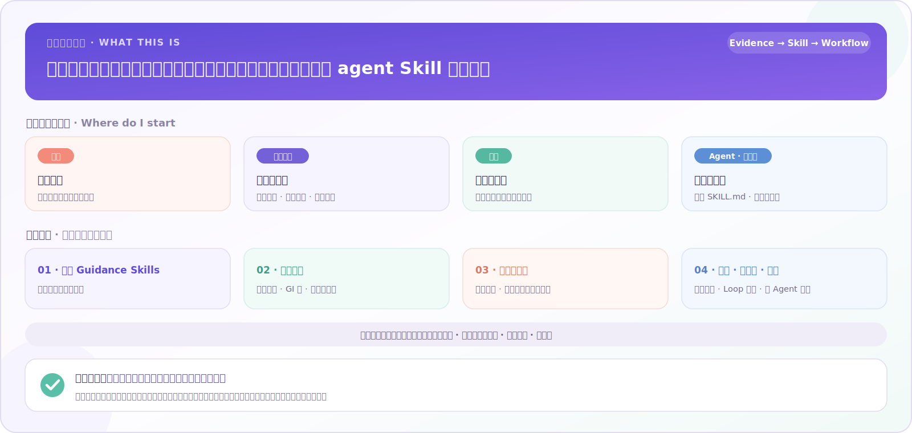
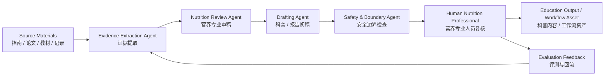

<div align="center">

# Nutrition Assistants｜圆酱营养助手合集

**把权威营养资料与指南，转成可追溯、可复用、带人审边界的 agent Skill 与工作流**

Turning authoritative nutrition sources and guidelines into traceable, reusable agent Skills and workflows, with human-review boundaries.

[](#project-overview)
[](#ai-applications)
[](#maintainer)
[](README.en.md)

**[English README](README.en.md)** · [从哪里开始](#start-here) · [内容地图](#content-map) · [仓库结构](#repo-structure) · [安全边界](#safety-scope)



</div>

> **安全边界｜Safety boundary**
>
> 本项目用于**营养教育、资料结构化与专业复核辅助**；不提供医学诊断、个体化处方、治疗替代、疗效保证或法规审批工具。涉及疾病、用药或其他风险情形，请咨询医生、注册营养师等合格专业人员。
>
> This project is for **nutrition education, structured knowledge organization, and professional review support** — not a diagnosis, prescription, treatment-replacement, efficacy-guarantee, or regulatory-approval tool.

<a id="project-introduction"></a>

## Project Introduction｜项目简介

> **Tagline / 项目一句话**  
> **Evidence-informed nutrition education, AI-assisted nutrition workflows, guideline-to-skill automation, and nutrition loop assistants, maintained by Wang Runyuan, a China Registered Nutritionist and master’s graduate in Nutrition and Food Hygiene from Kunming Medical University.**  
> **由毕业于昆明医科大学营养与食品卫生学专业的硕士、中国注册营养师王润圆维护的，基于证据的营养教育、AI 辅助营养工作流、指南自动化 Skill 与营养 loop 助手开源项目。**

Nutrition Assistants turns nutrition sources and guidance into traceable, reusable agent Skills and workflows: structured source boundaries, evidence organization, human-review checkpoints, and public education materials. It is maintained by Wang Runyuan as an open-source collection for education, research, and professional workflow support—not a diagnosis, prescription, treatment-replacement, efficacy-guarantee, or regulatory-approval tool.

Nutrition Assistants 把营养资料与指南转化为可追溯、可复用的 agent Skill 与工作流：保留来源边界，组织证据，设置人类复核节点，并产出营养科普材料。项目面向营养教育、研究与专业工作流辅助；不提供诊断、处方、治疗替代、疗效保证或法规审批工具。

<a id="start-here"></a>

## Who should start where｜从哪里开始

| 读者 | 从这里开始 | 用途 |
|---|---|---|
| 🌱 公众与营养科普读者 | [`shiwu-guanxing/`](shiwu-guanxing/) 或主题食养助手 | 看可信、易懂的营养科普；先阅读各目录说明与安全边界 |
| 👩‍⚕️ 营养专业人员 | [`yuanjiang-nutritionist-diet-evaluation-assistant-skill/`](yuanjiang-nutritionist-diet-evaluation-assistant-skill/) 和主题食养助手 | 资料整理、科普初稿与专业复核辅助 |
| 🔬 研究者 | [`nutrition-skill-methodology/`](nutrition-skill-methodology/) · [`book-to-skill-distillation/`](book-to-skill-distillation/) · [`multi-agent-research/`](multi-agent-research/) | 方法论、蒸馏流程与多 Agent 研究方向 |
| 🤖 Agent / 开发贡献者 | [`functional-medicine-skill/`](functional-medicine-skill/) · [`cspi-uncompromised-dga/`](cspi-uncompromised-dga/) 及各目录的 `SKILL.md`、验证材料 | 可移植 Skill 的加载、验证与工作流接入 |

<a id="content-map"></a>

## Content map｜内容地图

四类内容各有位置；完整目录见[仓库结构](#repo-structure)。

| # | 板块 | 主要内容 | 代表目录 |
|---|---|---|---|
| 01 | 🥗 食养 Guidance Skills | 面向疾病 / 主题的食养助手，用于教育与专业复核辅助 | [`diabetes-food-guide-skill/`](diabetes-food-guide-skill/) · [`ckd-food-guide-skill/`](ckd-food-guide-skill/) · [`hypertension-food-guide/`](hypertension-food-guide/) 等 |
| 02 | 📊 参考数据 | 食物成分、GI 表与营养素定义 | [`china-food-composition/`](china-food-composition/) |
| 03 | 🌐 科普与媒体 | 公众沟通、科普网页与媒体生产 | [`shiwu-guanxing/`](shiwu-guanxing/) · [`chinese-dreamcore-nutrition-skills/`](chinese-dreamcore-nutrition-skills/) 等 |
| 04 | 🔁 方法 · 工作流 · 研究 | 蒸馏方法论、指南自动化、营养 loop 助手与多 Agent 研究 | [`nutrition-skill-methodology/`](nutrition-skill-methodology/) · [`loop-engineering/`](loop-engineering/) · [`loop-dietary-guide-assistant/`](loop-dietary-guide-assistant/) · [`multi-agent-research/`](multi-agent-research/) 等 |

各板块成熟度不同：[`multi-agent-research/`](multi-agent-research/) 为早期研究占位；[`yuan-nutrition-mas-harness/`](yuan-nutrition-mas-harness/) 维护中（会议评审前公开入口有限）。状态只标注仓库能证实的事实。

<a id="project-goal"></a>

## Project Goal｜项目目标

Nutrition Assistants（圆酱营养助手合集）是由中国注册营养师王润圆维护的开源营养教育与 AI 工作流项目。它将专业营养资料、食养指南、美国膳食指南相关资料和参考数据结构化为可复用的 AI Skills、食养助手、科普内容、指南自动化流程、营养 loop 助手与营养师工作流，用于营养教育、资料整理、状态化追踪和专业复核辅助；本项目不提供医学诊断或个体化治疗方案。

项目希望让可靠的营养知识更容易被理解、复核和应用：一方面为公众提供更清晰的营养科普入口，另一方面为营养专业人员提供可复用、可审计、可持续更新的 AI 辅助工作流。

Nutrition Assistants is an open-source nutrition education and AI workflow project maintained by Wang Runyuan, a China Registered Nutritionist. It turns professional nutrition sources, dietary guidance materials, U.S. dietary-guideline materials, and reference data into reusable AI skills, dietary guidance assistants, education resources, guideline-automation workflows, stateful nutrition loop assistants, and nutritionist-facing workflows. The project is intended for education, structured knowledge organization, recurring workflow support, and professional review support — not for medical diagnosis or individualized treatment.

---

## Navigation｜导航

- [Project Introduction｜项目简介](#project-introduction)
- [Who should start where｜从哪里开始](#start-here)
- [Content map｜内容地图](#content-map)
- [Project Goal｜项目目标](#project-goal)
- [Project Overview｜项目概览](#project-overview)
- [Repository Structure｜仓库结构](#repo-structure)
- [Covered Conditions｜覆盖主题 / 疾病方向](#covered-conditions)
- [AI Applications｜AI 应用方向](#ai-applications)
- [Future Development Roadmap｜未来路线图](#future-development-roadmap)
- [Multi-Agent Nutrition Assessment Research｜多 Agent 营养评估研究](#multi-agent-research)
- [Maintainer｜维护者](#maintainer)
- [Safety Scope｜安全边界](#safety-scope)
- [License｜许可说明](#license)

---

<a id="project-overview"></a>

## Project Overview｜项目概览

**English**

Nutrition Assistants is a serious open-source nutrition education and AI-assisted nutrition workflow project maintained by Wang Runyuan, a China Registered Nutritionist and master’s graduate in Nutrition and Food Hygiene from Kunming Medical University. It collects structured dietary guidance assistants, nutrition education resources, reusable AI skills, guideline-to-skill automation examples, loop-capable nutrition assistant patterns, workflow templates, and early multi-agent research directions for nutrition assessment.

The repository is designed for:

- **Open-source contributors** who want to improve evidence-informed nutrition education tools.
- **Researchers interested in AI + Nutrition** who need structured examples of nutrition assistant workflows.
- **Nutrition professionals** who want safer AI support for record organization, education material drafting, and workflow automation.
- **Open-source contributors and AI researchers** who need to understand the project scope, evidence boundaries, and future research direction.

This is **not** a generic nutrition folder and **not** a medical diagnosis system. It is an open-source collection that connects:

```text
official / professional nutrition sources
        ↓
structured knowledge and dietary guidance content
        ↓
AI-oriented skills and workflows
        ↓
nutrition education and professional review
        ↓
future multi-agent nutrition assessment research
```

**中文**

Nutrition Assistants（圆酱营养助手合集）不是泛泛的“营养资料仓库”，也不是替代医生或营养师的诊疗系统。它是一个由毕业于昆明医科大学营养与食品卫生学专业的硕士、中国注册营养师王润圆维护的完整 AI 开源项目：把**食养指南资料、营养教育资源、可复用 AI Skill、美国膳食指南自动化示例、营养 loop 助手、营养师应用助手、科普网页、工作流与多 Agent 研究方向**放在同一个开源集合中。

它服务于：

- 希望参与营养教育工具建设的开源贡献者；
- 关注 **AI + Nutrition** 的研究者；
- 希望用 AI 提高资料整理、饮食记录结构化、科普生产效率的营养专业人员；
- 需要理解项目范围、证据边界和未来研究方向的开源贡献者与 AI 研究者。

项目核心闭环是：

```text
权威 / 专业营养资料
        ↓
结构化食养内容与证据边界
        ↓
AI Skill 与工作流
        ↓
营养教育与专业复核
        ↓
未来多 Agent 营养评估研究
```

---

<a id="repo-structure"></a>

## Repository Structure｜仓库结构

### High-level map｜总览

| Area | 中文模块 | What it contains | Representative directories |
|---|---|---|---|
| 🧪 Distillation methodology | 蒸馏方法论 | How to turn books, guidelines, and professional material into reusable AI skills | [`nutrition-skill-methodology/`](nutrition-skill-methodology/), [`book-to-skill-distillation/`](book-to-skill-distillation/) |
| 🧭 Guideline automation | 指南自动化 / 营养政策 | Agent-native automation distilled from dietary guidelines and nutrition policy documents | [`cspi-uncompromised-dga/`](cspi-uncompromised-dga/) |
| 🥗 Dietary guidance assistants | 食养助手（资料 / Skills） | Structured dietary guidance assistants for nutrition-related conditions | [`diabetes-food-guide-skill/`](diabetes-food-guide-skill/), [`ckd-food-guide-skill/`](ckd-food-guide-skill/), [`hypertension-food-guide/`](hypertension-food-guide/) |
| 👩‍⚕️ Nutritionist application assistant | 营养师应用助手 | Professional workflow support for organizing three-day diet records and nutritionist-facing assessment materials | [`yuanjiang-nutritionist-diet-evaluation-assistant-skill/`](yuanjiang-nutritionist-diet-evaluation-assistant-skill/) |
| 🔬 Portable evidence-review Skill | 功能医学综合 Skill | Portable for agents and oriented to evidence organization and reviewable drafts; not a diagnosis, prescription, treatment replacement, efficacy guarantee, or regulatory-approval tool | [`functional-medicine-skill/`](functional-medicine-skill/) |
| 🌐 Public education projects | 科普网页 / 营养传播 | Public-facing nutrition education and communication examples | [`shiwu-guanxing/`](shiwu-guanxing/), [`glucose-revolution-skill/`](glucose-revolution-skill/), [`nutrition-taibai-growth/`](nutrition-taibai-growth/) |
| 📊 Reference data | 参考数据 | Structured food composition data, GI tables, nutrient definitions | [`china-food-composition/`](china-food-composition/) |
| 🤖 Workflows & multi-agent research | 工作流、Loop 与多 Agent 研究 | Nutrition content production workflow, loop-capable dietary assistants, and future multi-agent nutrition assessment exploration | [`yuanjiang-nutrition-production-line-skill/`](yuanjiang-nutrition-production-line-skill/), [`loop-dietary-guide-assistant/`](loop-dietary-guide-assistant/), [`loop-engineering/`](loop-engineering/), [`multi-agent-research/`](multi-agent-research/) |
| 🎨 Nutrition media production | 中式梦核营养科普生产 | Cute-first image/video production skills for Chinese dreamcore nutrition education: evidence cards, no-text base-image prompts, backend/BLOCKED contracts, local prototype fallback, and trial reports. | [`chinese-dreamcore-nutrition-skills/`](chinese-dreamcore-nutrition-skills/) |
| 🧭 Project under maintenance | 项目维护中 | **Temporarily under maintenance（维护中）** — this entry is being reviewed before conference submission; implementation details are not publicly available at this time. | [`yuan-nutrition-mas-harness/`](yuan-nutrition-mas-harness/) |

### Main directories｜主要目录

| Directory | 中文说明 | English description |
|---|---|---|
| [`obesity-food-guide/`](obesity-food-guide/) | 成人肥胖食养助手 | Dietary guidance assistant for adult obesity education. |
| [`child-obesity-food-guide-skill/`](child-obesity-food-guide-skill/) | 儿童青少年肥胖食养 Skill | Skill package for childhood and adolescent obesity nutrition education. |
| [`childhood-obesity-agent/`](childhood-obesity-agent/) | 儿童肥胖 Agent 示例 | Agent-style childhood obesity nutrition assistant example. |
| [`diabetes-food-guide-skill/`](diabetes-food-guide-skill/) | 糖尿病食养助手 | Dietary guidance assistant for diabetes-related nutrition education. |
| [`ckd-food-guide-skill/`](ckd-food-guide-skill/) | 慢性肾病食养助手 | Dietary guidance assistant for chronic kidney disease nutrition education. |
| [`functional-medicine-skill/`](functional-medicine-skill/) | 功能医学综合 Skill | Portable agent Skill for evidence organization and drafts for qualified professional review; not a diagnosis, prescription, treatment replacement, efficacy guarantee, or regulatory-approval tool. |
| [`hypertension-food-guide/`](hypertension-food-guide/) | 高血压食养助手 | Dietary guidance assistant for hypertension nutrition education. |
| [`hyperlipidemia-food-guide/`](hyperlipidemia-food-guide/) | 高脂血症食养助手 | Dietary guidance assistant for hyperlipidemia nutrition education. |
| [`osteoporosis-food-guide-skill/`](osteoporosis-food-guide-skill/) | 骨质疏松食养助手 | Dietary guidance assistant for osteoporosis nutrition education. |
| [`sarcopenia-food-guide-skill/`](sarcopenia-food-guide-skill/) | 肌少症食养助手 | Dietary guidance assistant for sarcopenia nutrition education. |
| [`gout-dietary-guide/`](gout-dietary-guide/) | 痛风食养助手 | Dietary guidance assistant for gout nutrition education. |
| [`stroke-food-guide-skill/`](stroke-food-guide-skill/) | 卒中恢复期食养助手 | Dietary guidance assistant for stroke recovery nutrition education. |
| [`stunting-dietary-guide/`](stunting-dietary-guide/) | 儿童生长迟缓食养助手 | Dietary guidance assistant for childhood stunting / growth nutrition education. |
| [`nutrition-skill-methodology/`](nutrition-skill-methodology/) | 食养指南蒸馏方法论 | Methodology for turning nutrition guidelines into safer assistant skills. |
| [`book-to-skill-distillation/`](book-to-skill-distillation/) | 书籍 / 资料到 Skill 蒸馏 | Workflow for distilling long-form material into reusable AI skills. |
| [`cspi-uncompromised-dga/`](cspi-uncompromised-dga/) | 美国膳食指南自动化 Skill | Agent-native automation distilled from CSPI & Center for Biological Diversity's *The Uncompromised Dietary Guidelines for Americans, 2025–2030*; covers five guidelines, the Eat Healthy Your Way pattern, quantitative targets, sustainability, alcohol-context cautions, and evidence/policy boundaries. |
| [`loop-dietary-guide-assistant/`](loop-dietary-guide-assistant/) | 营养 loop / 循环式膳食指南助手 | Loop-capable dietary guideline assistant combining Uncompromised DGA content with loop engineering: scheduled checks, auto-triage, maker-checker verification, persistent state, and safety escalation. |
| [`loop-engineering/`](loop-engineering/) | Loop Engineering 方法论 | General loop-engineering pattern distilled from Addy Osmani's article: automations, worktrees, skills, connectors, sub-agents, state, maker-checker split, and loop safety dangers. |
| [`yuanjiang-nutritionist-diet-evaluation-assistant-skill/`](yuanjiang-nutritionist-diet-evaluation-assistant-skill/) | 圆酱营养师膳食评价助手 | Nutritionist-facing assistant for structuring messy three-day diet records. |
| [`yuanjiang-nutrition-production-line-skill/`](yuanjiang-nutrition-production-line-skill/) | 圆酱营养科普生产线 | Multi-step workflow for nutrition public education content production. |
| [`chinese-dreamcore-nutrition-skills/`](chinese-dreamcore-nutrition-skills/) | 中式梦核营养图片/视频生产 Skills | Callable image/video production skills for cute-first Chinese dreamcore nutrition education; includes backend/BLOCKED contracts and a GPT apple-theme trial run. |
| [`yuan-nutrition-mas-harness/`](yuan-nutrition-mas-harness/) | Yuan Nutrition MAS Harness | **Temporarily under maintenance（维护中）**. This project is being reviewed before conference submission, so the public entry is intentionally limited for now. |
| [`shiwu-guanxing/`](shiwu-guanxing/) | 食物观星 | Public-facing nutrition education web / communication project. |
| [`nutrition-history-anti-hallucination-skill/`](nutrition-history-anti-hallucination-skill/) | 营养学历史防幻觉 | Anti-hallucination workflow for nutrition history and historical texts. |
| [`multi-agent-research/`](multi-agent-research/) | 多 Agent 营养评估研究 | Early research placeholder for future multi-agent nutrition assessment systems. |
| [`china-food-composition/`](china-food-composition/) | 中国食物成分表（标准版第6版） | Knowledge base distilled from *China Food Composition Tables* (Standard Edition, 6th Ed.). Contains food classification system (21 categories), 259-food glycemic index table, nutrient definitions with INFOODS Tagname, amino acid & fatty acid nomenclature, phytochemical reference metadata, and methodology notes. Created by Wang Runyuan. |

---

<a id="covered-conditions"></a>

## Covered Conditions｜覆盖主题 / 疾病方向

The repository currently includes dietary guidance assistants and nutrition education resources for the following areas:

| # | Condition / Topic | 中文 | Directory |
|---:|---|---|---|
| 1 | Obesity | 成人肥胖 | [`obesity-food-guide/`](obesity-food-guide/) |
| 2 | Childhood obesity | 儿童青少年肥胖 | [`child-obesity-food-guide-skill/`](child-obesity-food-guide-skill/) |
| 3 | Diabetes | 糖尿病 | [`diabetes-food-guide-skill/`](diabetes-food-guide-skill/) |
| 4 | Chronic kidney disease | 慢性肾病 | [`ckd-food-guide-skill/`](ckd-food-guide-skill/) |
| 5 | Hypertension | 高血压 | [`hypertension-food-guide/`](hypertension-food-guide/) |
| 6 | Hyperlipidemia | 高脂血症 | [`hyperlipidemia-food-guide/`](hyperlipidemia-food-guide/) |
| 7 | Osteoporosis | 骨质疏松 | [`osteoporosis-food-guide-skill/`](osteoporosis-food-guide-skill/) |
| 8 | Sarcopenia | 肌少症 | [`sarcopenia-food-guide-skill/`](sarcopenia-food-guide-skill/) |
| 9 | Gout | 痛风 | [`gout-dietary-guide/`](gout-dietary-guide/) |
| 10 | Stroke recovery | 卒中恢复期 | [`stroke-food-guide-skill/`](stroke-food-guide-skill/) |
| 11 | Childhood stunting / growth | 儿童生长迟缓 / 生长发育 | [`stunting-dietary-guide/`](stunting-dietary-guide/) |
| 12 | Food composition reference | 中国食物成分表 | [`china-food-composition/`](china-food-composition/) |
| 13 | U.S. dietary guidelines / nutrition policy | 美国膳食指南 / 营养政策 | [`cspi-uncompromised-dga/`](cspi-uncompromised-dga/) |
| 14 | Nutrition loop assistant | 营养 loop / 循环式膳食指南助手 | [`loop-dietary-guide-assistant/`](loop-dietary-guide-assistant/) |

Many of these assistants are based on structured interpretation of official Chinese dietary guidance materials, especially public dietary guidance documents from the National Health Commission of China and related professional nutrition references. Each assistant should be used for **education and professional workflow support**, not for diagnosis or individualized medical treatment.

以上内容主要用于**营养教育、资料结构化、专业工作流辅助与科普传播**，不能替代医生诊断、临床治疗或个体化营养处方。

---

<a id="ai-applications"></a>

## AI Applications｜AI 应用方向

| Application | 中文用途 | Why it matters |
|---|---|---|
| 📚 Evidence organization | 证据整理 | Turn guidelines, books, and professional references into structured, reviewable knowledge. |
| 🧩 Skill distillation | Skill 蒸馏 | Convert nutrition knowledge into reusable AI assistant behaviors with boundaries and safety rules. |
| 🧭 Guideline automation | 指南自动化 | Turn dietary guidelines and nutrition policy documents into routed, testable, agent-native skills with source boundaries and red lines. |
| 🔁 Nutrition loops | 营养 loop | Design recurring dietary-guidance workflows that triage questions, verify claims with maker-checker separation, track state, and escalate risky cases. |
| 📝 Diet record structuring | 饮食记录结构化 | Help nutritionists organize messy text, chat logs, and three-day diet records into reviewable tables. |
| 🌱 Nutrition education drafting | 营养科普初稿 | Draft plain-language education material while preserving evidence boundaries. |
| 🎨 Image/video production | 中式梦核营养图片/视频生产 | Produce cute-first Chinese dreamcore nutrition visuals and short-video assets while keeping nutrition facts evidence-card-bound and models away from Chinese body text. |
| 🔍 Anti-hallucination review | 防幻觉审查 | Check citations, claims, source hierarchy, and medical safety boundaries. |
| 🤖 Multi-agent workflows | 多 Agent 工作流 | Explore division of labor among evidence extraction, nutrition review, writing, media generation, and quality assurance agents. |
| 📊 Evaluation datasets | 评测集建设 | Build test cases for nutrition advice safety, citation accuracy, and professional review quality. |

---

<a id="future-development-roadmap"></a>

## Future Development Roadmap｜未来路线图

| Phase | English | 中文 |
|---|---|---|
| ✅ Phase 1 | Collect dietary guidance assistants and nutrition education skills in one repository. | 汇集食养助手、营养教育 Skill 与营养师应用助手。 |
| ✅ Phase 2 | Add bilingual README, professional positioning, repository map, and maintainer profile. | 增加中英双语 README、专业定位、仓库地图与维护者介绍。 |
| 🔄 Phase 3 | Improve source labeling, evidence hierarchy, evaluation checklists, and safety red lines for each assistant. | 完善每个助手的来源分层、证据等级、评测清单与医学安全红线。 |
| 🔄 Phase 4 | Build repeatable workflows for nutrition education production, diet record structuring, and professional review. | 建立营养科普生产、饮食记录整理、专业审稿的可复用工作流。 |
| 🔬 Phase 5 | Prototype multi-agent nutrition assessment research: evidence agent, nutrition review agent, writing agent, safety agent, and evaluation agent. | 原型化多 Agent 营养评估研究：资料 Agent、证据 Agent、营养审稿 Agent、文案 Agent、安全评测 Agent。 |
| 🚀 Phase 6 | Run larger-scale evidence extraction, bilingual documentation, safety evaluation, and workflow automation experiments under professional review. | 在专业复核下推进更大规模的证据提取、中英双语文档、安全评测与工作流自动化实验。 |

---

<a id="multi-agent-research"></a>

## Multi-Agent Nutrition Assessment Research｜多 Agent 营养评估研究

Future work will explore a reviewed, safety-first multi-agent workflow for nutrition assessment and education.

未来方向是构建一个“营养专业人员可复核、证据边界清晰、安全优先”的多 Agent 营养评估与教育工作流。



Key research questions:

- How can AI assistants preserve evidence hierarchy instead of flattening all sources into one “answer”?
- How can nutrition professionals review AI output efficiently without losing professional control?
- How can multi-agent workflows reduce hallucinated citations, exaggerated claims, and unsafe nutrition advice?
- How can education-oriented nutrition assistants remain helpful while clearly refusing diagnosis or treatment decisions?

核心研究问题：

- 如何让 AI 保留证据层级，而不是把所有来源压平成一个“答案”？
- 如何让营养专业人员高效复核 AI 输出，同时不失去专业控制权？
- 如何用多 Agent 工作流减少伪引用、夸大疗效和不安全营养建议？
- 如何让营养教育助手既有帮助，又清楚拒绝诊断和治疗决策？

---

<a id="maintainer"></a>

## Maintainer｜维护者

**Wang Runyuan / 王润圆**

- Master’s graduate in Nutrition and Food Hygiene from Kunming Medical University.  
  毕业于昆明医科大学营养与食品卫生学专业的硕士。
- China Registered Nutritionist.  
  中国注册营养师。
- Maintains this repository as a nutrition professional exploring open-source nutrition education, AI-assisted nutrition workflows, and future multi-agent nutrition assessment research.  
  作为营养专业人员维护本项目，探索开源营养教育、AI 辅助营养工作流与未来多 Agent 营养评估研究。
- The author avatar used for this project is a real photo of the maintainer.  
  项目中使用的作者头像为维护者本人真实头像。

---

<a id="safety-scope"></a>

## Safety Scope｜安全边界

This repository is for **nutrition education, structured knowledge organization, and professional workflow support**.

本仓库用于**营养教育、资料结构化与专业工作流辅助**。

It does **not** provide:

- medical diagnosis;
- individualized treatment plans;
- emergency medical advice;
- replacement for physicians, registered dietitians, or qualified nutrition professionals.

本项目不提供：

- 医学诊断；
- 个体化治疗处方；
- 急症处理建议；
- 对医生、注册营养师或其他合格专业人员的替代。

For any disease, medication, pregnancy, child growth, kidney disease, eating disorder, unexplained weight loss, or severe symptom scenario, users should seek professional medical or nutrition care.

涉及疾病、用药、孕期、儿童生长发育、肾病、进食障碍、不明原因体重下降或严重症状时，应寻求医生或营养专业人员帮助。

---

<a id="license"></a>

## License｜许可说明

This repository is a collection of multiple nutrition education resources, AI skills, scripts, and workflow examples. Some subdirectories already include their own `LICENSE` files. Please check the license information inside each subdirectory before reuse.

本仓库集合了多个营养教育资料、AI Skill、脚本与工作流示例。部分子目录已经包含各自的 `LICENSE` 文件。复用前请优先查看对应子目录内的许可说明。

Nutrition guidelines, public documents, books, papers, and third-party source materials remain subject to their original publishers’ rights and citation requirements.

指南、公开文件、书籍、论文与第三方资料仍受其原始发布方版权与引用规则约束。

---

## Citation / Attribution｜引用与署名建议

If you reference this repository, please cite it as:

```text
Wang Runyuan. Nutrition Assistants: Evidence-informed nutrition education and AI-assisted nutrition workflows. GitHub repository, 2026.
```

如果引用本仓库，可署名为：

```text
王润圆：Nutrition Assistants｜圆酱营养助手合集，基于证据的营养教育与 AI 辅助营养工作流开源项目，GitHub，2026。
```

---

> **禁止抄袭商用，违者等同盗法，因果自负**
> **Plagiarism and commercial use are strictly prohibited. Violators shall be deemed as thieves of sacred scriptures and shall face divine karmic retribution themselves.**
>
> 公益开源项目，禁止商用 | Public welfare open-source project, commercial use prohibited
> License: CC BY-NC 4.0
