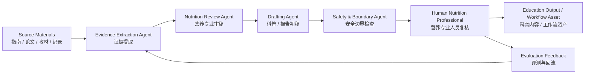

# Nutrition Assistants｜圆酱营养助手合集

[](#project-overview--项目概览)
[](#ai-applications--ai-应用方向)
[](#maintainer--维护者)
[](#navigation--导航)

> **Tagline / 项目一句话**  
> **Evidence-informed nutrition education and AI-assisted nutrition workflows, maintained by Wang Runyuan, a China Registered Nutritionist and master’s graduate in Nutrition and Food Hygiene from Kunming Medical University.**  
> **由毕业于昆明医科大学营养与食品卫生学专业的硕士、中国注册营养师王润圆维护的，基于证据的营养教育与 AI 辅助营养工作流开源项目。**

**Suggested GitHub About description / 建议 GitHub About 描述**  
A bilingual open-source nutrition education and AI-assisted nutrition workflow project maintained by Wang Runyuan, a China Registered Nutritionist and master’s graduate in Nutrition and Food Hygiene from Kunming Medical University, covering dietary guidance assistants, nutritionist-facing tools, public education resources, skill distillation methodology, workflows, and multi-agent nutrition assessment research.

**建议中文描述**  
由毕业于昆明医科大学营养与食品卫生学专业的硕士、中国注册营养师王润圆维护的中英双语开源营养教育与 AI 辅助营养工作流项目，包含食养助手资料、营养师应用助手、科普网页、蒸馏方法论、工作流与多 Agent 营养评估研究。

---

## Navigation｜导航

- [Project Overview｜项目概览](#project-overview--项目概览)
- [Repository Structure｜仓库结构](#repository-structure--仓库结构)
- [Covered Conditions｜覆盖主题 / 疾病方向](#covered-conditions--覆盖主题--疾病方向)
- [AI Applications｜AI 应用方向](#ai-applications--ai-应用方向)
- [Future Development Roadmap｜未来路线图](#future-development-roadmap--未来路线图)
- [Multi-Agent Nutrition Assessment Research｜多 Agent 营养评估研究](#multi-agent-nutrition-assessment-research--多-agent-营养评估研究)
- [Maintainer｜维护者](#maintainer--维护者)
- [Suggested Visual Assets｜建议补充的图片与架构图](#suggested-visual-assets--建议补充的图片与架构图)
- [License｜许可说明](#license--许可说明)

---

## Project Overview｜项目概览

**English**

Nutrition Assistants is a serious open-source nutrition education and AI-assisted nutrition workflow project maintained by Wang Runyuan, a China Registered Nutritionist and master’s graduate in Nutrition and Food Hygiene from Kunming Medical University. It collects structured dietary guidance assistants, nutrition education resources, reusable AI skills, workflow templates, and early multi-agent research directions for nutrition assessment.

The repository is designed for:

- **Open-source contributors** who want to improve evidence-informed nutrition education tools.
- **Researchers interested in AI + Nutrition** who need structured examples of nutrition assistant workflows.
- **Nutrition professionals** who want safer AI support for record organization, education material drafting, and workflow automation.
- **Open-source contributors and AI researchers** who need to understand the project scope, evidence boundaries, and future research direction.

This is **not** a generic nutrition folder and **not** a medical diagnosis system. It is an open-source collection that connects:

```text
official / professional nutrition sources
        ↓
structured knowledge and dietary guidance content
        ↓
AI-oriented skills and workflows
        ↓
nutrition education and professional review
        ↓
future multi-agent nutrition assessment research
```

**中文**

Nutrition Assistants（圆酱营养助手合集）不是泛泛的“营养资料仓库”，也不是替代医生或营养师的诊疗系统。它是一个由毕业于昆明医科大学营养与食品卫生学专业的硕士、中国注册营养师王润圆维护的完整 AI 开源项目：把**食养指南资料、营养教育资源、可复用 AI Skill、营养师应用助手、科普网页、工作流与多 Agent 研究方向**放在同一个开源集合中。

它服务于：

- 希望参与营养教育工具建设的开源贡献者；
- 关注 **AI + Nutrition** 的研究者；
- 希望用 AI 提高资料整理、饮食记录结构化、科普生产效率的营养专业人员；
- 需要理解项目范围、证据边界和未来研究方向的开源贡献者与 AI 研究者。

项目核心闭环是：

```text
权威 / 专业营养资料
        ↓
结构化食养内容与证据边界
        ↓
AI Skill 与工作流
        ↓
营养教育与专业复核
        ↓
未来多 Agent 营养评估研究
```

---

## Repository Structure｜仓库结构

### High-level map｜总览

| Area | 中文模块 | What it contains | Representative directories |
|---|---|---|---|
| 🧪 Distillation methodology | 蒸馏方法论 | How to turn books, guidelines, and professional material into reusable AI skills | [`nutrition-skill-methodology/`](nutrition-skill-methodology/), [`book-to-skill-distillation/`](book-to-skill-distillation/) |
| 🥗 Dietary guidance assistants | 食养助手（资料 / Skills） | Structured dietary guidance assistants for nutrition-related conditions | [`diabetes-food-guide-skill/`](diabetes-food-guide-skill/), [`ckd-food-guide-skill/`](ckd-food-guide-skill/), [`hypertension-food-guide/`](hypertension-food-guide/) |
| 👩‍⚕️ Nutritionist application assistant | 营养师应用助手 | Professional workflow support for organizing three-day diet records and nutritionist-facing assessment materials | [`yuanjiang-nutritionist-diet-evaluation-assistant-skill/`](yuanjiang-nutritionist-diet-evaluation-assistant-skill/) |
| 🌐 Public education projects | 科普网页 / 营养传播 | Public-facing nutrition education and communication examples | [`shiwu-guanxing/`](shiwu-guanxing/), [`glucose-revolution-skill/`](glucose-revolution-skill/), [`nutrition-taibai-growth/`](nutrition-taibai-growth/) |
| 🤖 Workflows & multi-agent research | 工作流与多 Agent 研究 | Nutrition content production workflow and future multi-agent nutrition assessment exploration | [`yuanjiang-nutrition-production-line-skill/`](yuanjiang-nutrition-production-line-skill/), [`multi-agent-research/`](multi-agent-research/) |

### Main directories｜主要目录

| Directory | 中文说明 | English description |
|---|---|---|
| [`obesity-food-guide/`](obesity-food-guide/) | 成人肥胖食养助手 | Dietary guidance assistant for adult obesity education. |
| [`child-obesity-food-guide-skill/`](child-obesity-food-guide-skill/) | 儿童青少年肥胖食养 Skill | Skill package for childhood and adolescent obesity nutrition education. |
| [`childhood-obesity-agent/`](childhood-obesity-agent/) | 儿童肥胖 Agent 示例 | Agent-style childhood obesity nutrition assistant example. |
| [`diabetes-food-guide-skill/`](diabetes-food-guide-skill/) | 糖尿病食养助手 | Dietary guidance assistant for diabetes-related nutrition education. |
| [`ckd-food-guide-skill/`](ckd-food-guide-skill/) | 慢性肾病食养助手 | Dietary guidance assistant for chronic kidney disease nutrition education. |
| [`hypertension-food-guide/`](hypertension-food-guide/) | 高血压食养助手 | Dietary guidance assistant for hypertension nutrition education. |
| [`hyperlipidemia-food-guide/`](hyperlipidemia-food-guide/) | 高脂血症食养助手 | Dietary guidance assistant for hyperlipidemia nutrition education. |
| [`osteoporosis-food-guide-skill/`](osteoporosis-food-guide-skill/) | 骨质疏松食养助手 | Dietary guidance assistant for osteoporosis nutrition education. |
| [`sarcopenia-food-guide-skill/`](sarcopenia-food-guide-skill/) | 肌少症食养助手 | Dietary guidance assistant for sarcopenia nutrition education. |
| [`gout-dietary-guide/`](gout-dietary-guide/) | 痛风食养助手 | Dietary guidance assistant for gout nutrition education. |
| [`stroke-food-guide-skill/`](stroke-food-guide-skill/) | 卒中恢复期食养助手 | Dietary guidance assistant for stroke recovery nutrition education. |
| [`stunting-dietary-guide/`](stunting-dietary-guide/) | 儿童生长迟缓食养助手 | Dietary guidance assistant for childhood stunting / growth nutrition education. |
| [`nutrition-skill-methodology/`](nutrition-skill-methodology/) | 食养指南蒸馏方法论 | Methodology for turning nutrition guidelines into safer assistant skills. |
| [`book-to-skill-distillation/`](book-to-skill-distillation/) | 书籍 / 资料到 Skill 蒸馏 | Workflow for distilling long-form material into reusable AI skills. |
| [`yuanjiang-nutritionist-diet-evaluation-assistant-skill/`](yuanjiang-nutritionist-diet-evaluation-assistant-skill/) | 圆酱营养师膳食评价助手 | Nutritionist-facing assistant for structuring messy three-day diet records. |
| [`yuanjiang-nutrition-production-line-skill/`](yuanjiang-nutrition-production-line-skill/) | 圆酱营养科普生产线 | Multi-step workflow for nutrition public education content production. |
| [`shiwu-guanxing/`](shiwu-guanxing/) | 食物观星 | Public-facing nutrition education web / communication project. |
| [`nutrition-history-anti-hallucination-skill/`](nutrition-history-anti-hallucination-skill/) | 营养学历史防幻觉 | Anti-hallucination workflow for nutrition history and historical texts. |
| [`multi-agent-research/`](multi-agent-research/) | 多 Agent 营养评估研究 | Early research placeholder for future multi-agent nutrition assessment systems. |

---

## Covered Conditions｜覆盖主题 / 疾病方向

The repository currently includes dietary guidance assistants and nutrition education resources for the following areas:

| # | Condition / Topic | 中文 | Directory |
|---:|---|---|---|
| 1 | Obesity | 成人肥胖 | [`obesity-food-guide/`](obesity-food-guide/) |
| 2 | Childhood obesity | 儿童青少年肥胖 | [`child-obesity-food-guide-skill/`](child-obesity-food-guide-skill/) |
| 3 | Diabetes | 糖尿病 | [`diabetes-food-guide-skill/`](diabetes-food-guide-skill/) |
| 4 | Chronic kidney disease | 慢性肾病 | [`ckd-food-guide-skill/`](ckd-food-guide-skill/) |
| 5 | Hypertension | 高血压 | [`hypertension-food-guide/`](hypertension-food-guide/) |
| 6 | Hyperlipidemia | 高脂血症 | [`hyperlipidemia-food-guide/`](hyperlipidemia-food-guide/) |
| 7 | Osteoporosis | 骨质疏松 | [`osteoporosis-food-guide-skill/`](osteoporosis-food-guide-skill/) |
| 8 | Sarcopenia | 肌少症 | [`sarcopenia-food-guide-skill/`](sarcopenia-food-guide-skill/) |
| 9 | Gout | 痛风 | [`gout-dietary-guide/`](gout-dietary-guide/) |
| 10 | Stroke recovery | 卒中恢复期 | [`stroke-food-guide-skill/`](stroke-food-guide-skill/) |
| 11 | Childhood stunting / growth | 儿童生长迟缓 / 生长发育 | [`stunting-dietary-guide/`](stunting-dietary-guide/) |

Many of these assistants are based on structured interpretation of official Chinese dietary guidance materials, especially public dietary guidance documents from the National Health Commission of China and related professional nutrition references. Each assistant should be used for **education and professional workflow support**, not for diagnosis or individualized medical treatment.

以上内容主要用于**营养教育、资料结构化、专业工作流辅助与科普传播**，不能替代医生诊断、临床治疗或个体化营养处方。

---

## AI Applications｜AI 应用方向

| Application | 中文用途 | Why it matters |
|---|---|---|
| 📚 Evidence organization | 证据整理 | Turn guidelines, books, and professional references into structured, reviewable knowledge. |
| 🧩 Skill distillation | Skill 蒸馏 | Convert nutrition knowledge into reusable AI assistant behaviors with boundaries and safety rules. |
| 📝 Diet record structuring | 饮食记录结构化 | Help nutritionists organize messy text, chat logs, and three-day diet records into reviewable tables. |
| 🌱 Nutrition education drafting | 营养科普初稿 | Draft plain-language education material while preserving evidence boundaries. |
| 🔍 Anti-hallucination review | 防幻觉审查 | Check citations, claims, source hierarchy, and medical safety boundaries. |
| 🤖 Multi-agent workflows | 多 Agent 工作流 | Explore division of labor among evidence extraction, nutrition review, writing, media generation, and quality assurance agents. |
| 📊 Evaluation datasets | 评测集建设 | Build test cases for nutrition advice safety, citation accuracy, and professional review quality. |

---

## Future Development Roadmap｜未来路线图

| Phase | English | 中文 |
|---|---|---|
| ✅ Phase 1 | Collect dietary guidance assistants and nutrition education skills in one repository. | 汇集食养助手、营养教育 Skill 与营养师应用助手。 |
| ✅ Phase 2 | Add bilingual README, professional positioning, repository map, and maintainer profile. | 增加中英双语 README、专业定位、仓库地图与维护者介绍。 |
| 🔄 Phase 3 | Improve source labeling, evidence hierarchy, evaluation checklists, and safety red lines for each assistant. | 完善每个助手的来源分层、证据等级、评测清单与医学安全红线。 |
| 🔄 Phase 4 | Build repeatable workflows for nutrition education production, diet record structuring, and professional review. | 建立营养科普生产、饮食记录整理、专业审稿的可复用工作流。 |
| 🔬 Phase 5 | Prototype multi-agent nutrition assessment research: evidence agent, nutrition review agent, writing agent, safety agent, and evaluation agent. | 原型化多 Agent 营养评估研究：资料 Agent、证据 Agent、营养审稿 Agent、文案 Agent、安全评测 Agent。 |
| 🚀 Phase 6 | Run larger-scale evidence extraction, bilingual documentation, safety evaluation, and workflow automation experiments under professional review. | 在专业复核下推进更大规模的证据提取、中英双语文档、安全评测与工作流自动化实验。 |

---

## Multi-Agent Nutrition Assessment Research｜多 Agent 营养评估研究

Future work will explore a reviewed, safety-first multi-agent workflow for nutrition assessment and education.

未来方向是构建一个“营养专业人员可复核、证据边界清晰、安全优先”的多 Agent 营养评估与教育工作流。



Key research questions:

- How can AI assistants preserve evidence hierarchy instead of flattening all sources into one “answer”?
- How can nutrition professionals review AI output efficiently without losing professional control?
- How can multi-agent workflows reduce hallucinated citations, exaggerated claims, and unsafe nutrition advice?
- How can education-oriented nutrition assistants remain helpful while clearly refusing diagnosis or treatment decisions?

核心研究问题：

- 如何让 AI 保留证据层级，而不是把所有来源压平成一个“答案”？
- 如何让营养专业人员高效复核 AI 输出，同时不失去专业控制权？
- 如何用多 Agent 工作流减少伪引用、夸大疗效和不安全营养建议？
- 如何让营养教育助手既有帮助，又清楚拒绝诊断和治疗决策？

---

## Maintainer｜维护者

**Wang Runyuan / 王润圆**

- Master’s graduate in Nutrition and Food Hygiene from Kunming Medical University.  
  毕业于昆明医科大学营养与食品卫生学专业的硕士。
- China Registered Nutritionist.  
  中国注册营养师。
- Maintains this repository as a nutrition professional exploring open-source nutrition education, AI-assisted nutrition workflows, and future multi-agent nutrition assessment research.  
  作为营养专业人员维护本项目，探索开源营养教育、AI 辅助营养工作流与未来多 Agent 营养评估研究。
- The author avatar used for this project is a real photo of the maintainer.  
  项目中使用的作者头像为维护者本人真实头像。

---

## Safety Scope｜安全边界

This repository is for **nutrition education, structured knowledge organization, and professional workflow support**.

本仓库用于**营养教育、资料结构化与专业工作流辅助**。

It does **not** provide:

- medical diagnosis;
- individualized treatment plans;
- emergency medical advice;
- replacement for physicians, registered dietitians, or qualified nutrition professionals.

本项目不提供：

- 医学诊断；
- 个体化治疗处方；
- 急症处理建议；
- 对医生、注册营养师或其他合格专业人员的替代。

For any disease, medication, pregnancy, child growth, kidney disease, eating disorder, unexplained weight loss, or severe symptom scenario, users should seek professional medical or nutrition care.

涉及疾病、用药、孕期、儿童生长发育、肾病、进食障碍、不明原因体重下降或严重症状时，应寻求医生或营养专业人员帮助。

---

## Suggested Visual Assets｜建议补充的图片与架构图

To improve GitHub presentation, the following assets are recommended:

为增强项目展示效果，建议后续补充：

1. **Repository banner / 项目横幅图**  
   A calm blue-green nutrition + AI workflow banner with the title “Nutrition Assistants”.

2. **Repository architecture diagram / 仓库结构图**  
   A diagram showing five blocks: methodology, dietary assistants, nutritionist application assistant, public education projects, workflows & multi-agent research.

3. **Multi-agent workflow illustration / 多 Agent 工作流图**  
   Evidence extraction → nutrition review → public education drafting → safety evaluation → professional review.

4. **Covered conditions matrix / 覆盖疾病矩阵图**  
   A visual grid of the 11 dietary guidance assistant areas.

5. **Professional maintainer card / 维护者专业卡片**  
   A simple maintainer card with Wang Runyuan’s professional background and the note that the avatar is a real photo.

---

## Suggested GitHub Topics｜建议 GitHub topics

```text
nutrition
nutrition-education
dietary-guidance
public-health
ai-for-health
ai-workflows
multi-agent
registered-nutritionist
china-nutrition
health-education
```

---

## License｜许可说明

This repository is a collection of multiple nutrition education resources, AI skills, scripts, and workflow examples. Some subdirectories already include their own `LICENSE` files. Please check the license information inside each subdirectory before reuse.

本仓库集合了多个营养教育资料、AI Skill、脚本与工作流示例。部分子目录已经包含各自的 `LICENSE` 文件。复用前请优先查看对应子目录内的许可说明。

Nutrition guidelines, public documents, books, papers, and third-party source materials remain subject to their original publishers’ rights and citation requirements.

指南、公开文件、书籍、论文与第三方资料仍受其原始发布方版权与引用规则约束。

---

## Citation / Attribution｜引用与署名建议

If you reference this repository, please cite it as:

```text
Wang Runyuan. Nutrition Assistants: Evidence-informed nutrition education and AI-assisted nutrition workflows. GitHub repository, 2026.
```

如果引用本仓库，可署名为：

```text
王润圆：Nutrition Assistants｜圆酱营养助手合集，基于证据的营养教育与 AI 辅助营养工作流开源项目，GitHub，2026。
```
